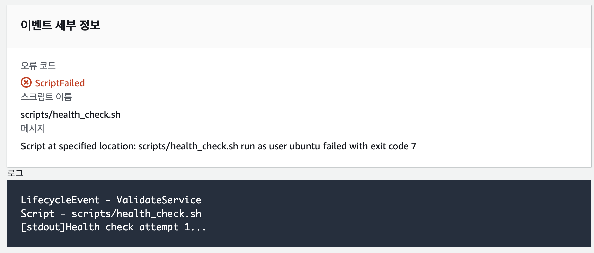

## CI/CD With CodeDepoly 
### CI 
- 기존에 풀퀘로 진행한 CI처럼 githubactions의 러너에서 빌드까지 진행
- 기존 SCP 압축 파일에 CodeDepoly 실행할 수 있는 appspec.yml, scripts/ 포함하여 압축파일 생성
    - 압축파일명은 $GITHUB_SHA(랜덤값 생성)으로 파일명 지정
- S3, CodeDepoly 접근할 수 있는 사용자 계정의 Access 값들을 셋팅
- S3에 압축파일 업로드 
- CodeDepoly에서 해당 압축파일에서 EC2로 전달 

### CD 
- Scripts 폴더 내에 있는 쉘스크립트가 appspec에서 명시한 훅 순서대로 진행
    - overwrite: 허용 
- ApplicationStop: pm2 stop
- BeforeInstall: 환경변수 생성(AWS Parameter Store)
- AfterInstall: npm 패키지 설치 & 마이그레이션 실행
- ApplicationStart: pm2 startOrReload
- ValidateService: 헬스 체크

### ETC
- EC2, RDS(mariadb) 셋팅 > node, pm2 설치(2025.12.25)
- 단일 서버로 운영했기 때문에 CD에서 마이그레이션 실행
- S3 & CodeDepoly 셋팅 & IAM 추가, EC2 내 code-depoly-agent 설치(2025.12.27)
    - CodeDepoly: CodeDepoly 접근할 수 있는 정책이 포함되어 있는 역할 추가
    - EC2: codeDepoly 접근할 수 있는 권한 추가
    - Githubactions 사용자: s3, codedepoly 접근할 수 있는 권한 추가 생성 후, access 키 생성
    - Code-depoly-agent 설치: https://docs.aws.amazon.com/ko_kr/codedeploy/latest/userguide/codedeploy-agent-operations-install-ubuntu.html
- log: 확인 /opt/codedeploy-agent/deployment-root/{deployment-group-ID}/{deployment-ID}/logs/scripts.log
- 환경변수
    - 기존에는 서버 내의 환경변수가 없으면, 배포 중지하거나 백업 파일을 만든 후에 새 환경 변수 파일을 생성
    - AWS Parameter Store 활용하여 환경변수들을 등록 후, 반복문으로 한개 한개 가져와서 환경변수 파일 구성 
        - 10,000개 미만은 공짜기이기 때문에 바로 등록해서 api 호출로 가져오는 걸로 변경 
        - 파라미터에 접근할 수 있는 권한은 EC2에 추가

### Error
- Error: Jest not found
    - npm ci --omit=dev 옵셥값을 줬는데, 이 옵션값 때문에 테스트 진행 에러
- Error: appspec.yml: Cannot stat: No such file or directory
    - 파일명 오타
- Error: Credentials could not be loaded, please check your action inputs: Could not load credentials from any providers
    - 시크릿 키 오타
- Error: creational 값이 있으면, ec2와 충돌나 parameter store에 있는 값을 못 가져옴 
- Error: An error occurred (AccessDeniedException) when calling the GetParametersByPath operation: User: arn:aws:iam::xxxxxx:user/gitactions-user is not authorized to perform: ssm:GetParametersByPath on resource: arn:aws:ssm:ap-northeast-2:xxxxxx:parameter/challenge-api/prod because no identity-based policy allows the ssm:GetParametersByPath action
    - EC2에 ssmManager Access 접근이 되어져 있다면, 서버 내에서 한번 더 사용자에 대한 configure를 등록하면, 충돌 발생 > configure 명시적으로 제거 
    ```shell
    rm -rf ~/.aws
    # 확인
    ls -la ~/.aws
    ```
- Error: You must specify a region. You can also configure your region by running "aws configure".
    - 지역 명시
- Error: An error occurred (AccessDeniedException) when calling the GetParametersByPath operation: User: arn:aws:sts::xxxxxx:assumed-role/code-deploy-ec2-role/i-069cab1b827924414 is not authorized to perform: ssm:GetParametersByPath on resource: arn:aws:ssm:ap-northeast-2:xxxxxx:parameter/challenge-api/prod because no identity-based policy allows the ssm:GetParametersByPath action
    - EC2에 권한 추가가 잘되지 않아, ssmManagerReadOnly Access로 변경
- Error: The `npm ci` command can only install with an existing package-lock.json or npm error npm-shrinkwrap.json with lockfileVersion >= 1. Run an install with npm@5 or npm error later to generate a package-lock.json file, then try again.
    - npm 실행 위치 오류

### 강제 Error
- 환경변수 파일 유무 확인: Parameter Store 전에 서버 내에 환경 변수 파일이 있는지 확인 후 배포 진행

- 헬스 체크 확인: start.sh에 일부러 pm2 실행을 주석 처리하여 validservice에서 헬스체크하는지 확인 


